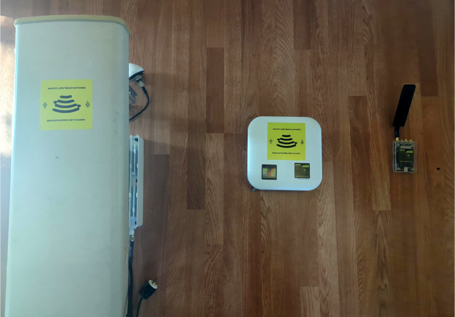

Hosting The Network
=================================

**What Is A Semaphore Network Host?**

A Semaphore Network Host is an individual, DAO, or entity deploying host node and radio hardware to provide Semaphore Network's Universal Basic Internet coverage in exchange for stablecoin payments and points.

**Prerequisites to Become a Host**

1. **Physical Space:** A clear outdoor area with compliance for radio emissions.
2. **Internet Access:** Outbound connection for web2 internet services.
3. **Radio and Node Hardware:** Combination of node and radio hardware for network deployment.

**Hardware Requirements:**

- **Node Hardware:** The job of the node hardware is to monitor the on-chain Subscriber Registry and a small CN
    this can run on minimal hardware like Raspberry Pi.

- **Radio Hardware:** The radio hardware will provide connectivity to subscribers;
    we support COTS or FLOSS options;  band and region agnostic.

=======================================
List of Tested Radio Host Hardware (eNodeB)
=======================================

 ================== ============ ========== ======= 
  Name               Band         Status     Type   
 ================== ============ ========== ======= 
  Baicells Nova227   CBRS         Working    COTS   
  Baicells Nova223   CBRS         Working    COTS   
  Blade RF xA9       Muilt (5G)   Working*   FOSS*  
  USRP/USRP Clones   Multi (5G)   Working*   FOSS*  
 ================== ============ ========== ======= 

Hardware Freedom
  You are free to choose what works best for your wallet, local DAO size and country's radio frequency regulations; up to and including running 
  a completely FLOSS hardware stack. Macro to femto sized setups.

*Figure: A variety of COTS and FLOSS Radio Options.*

**We do not gatekeep across hardware, locality or RF frontend**

**Setup**
______________________

**Setup**

- **Node Setup:**
  - Run EPC/CN and bridge middleware on hardware of your choosing
  - Get Public Key from middleware to register host on-chain.

- **Radio Unit Hardware Setup:**
  - Follow manufacturer's instructions for installation and mounting.
  - Configure radio unit's EPC/CN address to match Host Node.

- **Semaphore Host Registration:**
  - Register host through the bridge middleware at or input your public key at `Semaphore Network Host DAO <https://app.semaphore.network/host>`.

Using The Network
=================================

This section focuses on subscribing to decentralized Semaphore Network Hosts' internet services.

**Requirements**

*User Equipment*
  Subscribers need a device to connect to the network, users can bring their own COTS LTE/5G user equpiment; phone, modem etc. so long as the      below are true.

  - Device has a physical SIM-card slot.
  - Device supports bands provided by local hosts.

*Semaphore ETHSIM*
  Subscribers will need to obtain or create their own Semaphore ETHSIM to connect to the Network. You can buy one from us at                       https://shop.semaphore.network or bring your own compatible smartcard.

**Subscriber Setup**

For ease of use, you can automatically register your Semaphore ETHSIM by being in range of a network host. Alternaively we have a manual DApp that provides this functionality should you not be in a covered area.

- **Semaphore ETHSIM Setup:**
  - Users must insert the Semaphore Network USIM into their phone

- **Registering Semaphore ETHSIM On-Chain:**
  - User must visit be near a host for initial OTA registration, OR they can do it through the DApp below
  - Add Subscriber Authentication Keypair to on-chain registry at [Semaphore Network Subscription](https://app.semaphore.network/subscribe).

ETHSIM Security+
===============================

Semaphore Network leverages our unique ETHSIM wallet technology to enhance cellular radio link security and decentralize AAA (authentication, administration, and accounting) processes inside telco networks. Instead of relying on the traditional cellular network authentication system called `MILENAGE <https://www.sharetechnote.com/html/Handbook_LTE_Authentication.html>`_   we introduce modern asymmetric PKI cryptography via ECDH with Ethereum-native cryptography (secp256k1 & altbn128).

Introduction
------------

Semaphore Network's approach to security and decentralization in telecommunications is rooted in addressing the limitations of the traditional AAA and MILENAGE framework. By implementing hardware wallet security and smart contracts, we ensure a secure, soverign and decentralized telecommunications environment, even on devices as simple as flip phones.

Challenges with Traditional Systems
------------------------------------

MILENAGE, the conventional cellular network authentication system, necessitates a carrier-owned centralized database where all private key material is stored. This centralized approach poses significant security risks, as it places the security of user data in the hands of a few large telecommunications companies, which are prone to exploitation.

Key Improvements
----------------

Semaphore Network addresses these challenges through several key improvements:

1. **Ownership of Private Keys**: We move the private key out of a centralized database and into a sovereign physical ETHSIM wallet owned by the user. This eliminates vulnerabilities associated with SIM swaps and eavesdropping, and empowers users with a full Ethereum hardware wallet based on proven secure element technology, the same as popular hardware wallet brands such as Ledger, Grid+ & Status Keycard. 

2. **On-chain Subscriber Registry**: Subscriber public keys are stored on-chain in an immutable sovereign subscriber registry, similar to a telco HSS (Home Subscriber Server). This allows users to activate services, top-up their accounts with cryptocurrency, and perform other functions without the need for intermediaries, including potentially unreliable customer service.

3. **Global Roaming Subscribership**: By storing subscriber information on-chain, Semaphore Network ensures a truly global roaming subscribership, enhancing accessibility and connectivity for users worldwide.

Conclusion
----------

Semaphore Network's utilization of ETHSIM technology and innovative cryptographic techniques represents a significant advancement in the field of telecommunications security and decentralization. By addressing the limitations of traditional systems, we provide users with greater control over their data and a more secure telecommunications experience.

For more information, please refer to our `documentation <link_to_your_documentation_here>`_.

